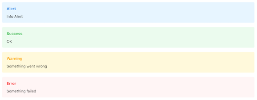
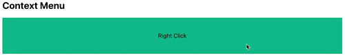
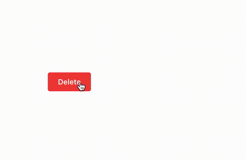

# wo/mantine

these are `@mantine/?` extra components

---
**Arato (named Alert):**



Example:

```tsx
<Arato.Info>Info Alert</Arato.Info>
<Arato.Success></Arato.Success>
<Arato.Warning></Arato.Warning>
<Arato.Error></Arato.Error>
```

---
**Context Menu (Menu with right-click trigger):**



Example:

```tsx
<ContextMenu>
    <ContextMenu.Target>
        <Center h={100} bg='teal'>
            Right Click
        </Center>
    </ContextMenu.Target>
    <ContextMenu.Dropdown>
        <ContextMenu.Item icon={<IconRefreshAlert />}>
            Undo
        </ContextMenu.Item>
        <ContextMenu.Item icon={<Icon3dRotate />}>Redo</ContextMenu.Item>
    </ContextMenu.Dropdown>
</ContextMenu>
```

---
**Confirm Popover:**



Example:

```tsx
<ConfirmPopover
    title='Are you absolutely sure?'
    description={
        <Text color='dimmed' size='sm'>
            What are you doing?
        </Text>
    }
    labels={{confirm: 'Let it go', cancel: 'Give up'}}
    confirmProps={{color: 'red'}}
    cancelProps={{color: 'gray'}}
    position='right'
    onCancel={() => {
        console.log('click cancel');
    }}
    onConfirm={() => {
        console.log('click confirm');
    }}
>
    <Button color='red'>Delete</Button>
</ConfirmPopover>
```
